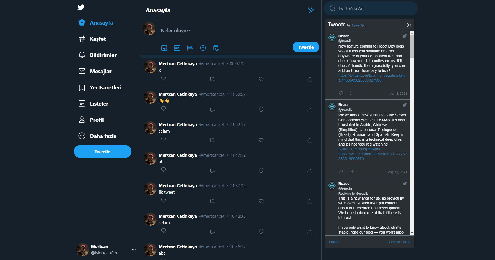
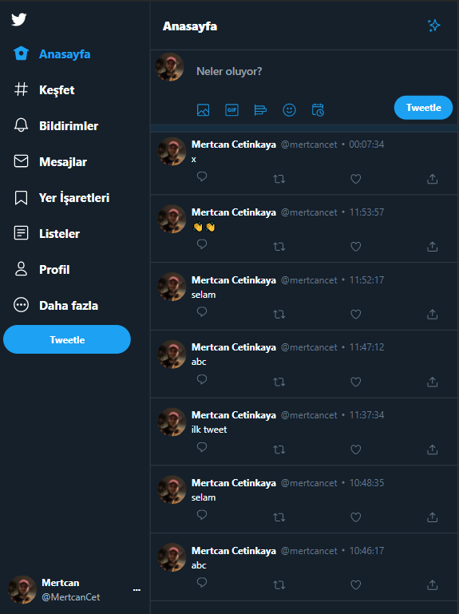
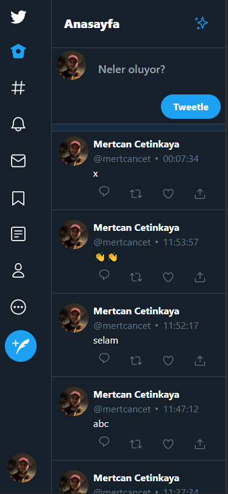

<br />
<p align="center">

  <h1 align="center">Twitter Clone App</h1>

</p>

<hr/>
I created a simple Twitter Clone application using TailwindCss  and NextJS.
I used firestore database so you can tweet on my demo link.

:earth_americas:  [Demo](https://twitter-clone-mertcancet.vercel.app/)

## ScreenShots

### PC Screen

### Tablet Screen

### Mobile Screen



### Built With

- [NextJS](https://nextjs.org/)
- [Firebase](https://firebase.google.com/)
- [TailwindCss](https://tailwindcss.com/)

- [Classnames](https://www.npmjs.com/package/classnames)

This project was bootstrapped with [Create Next App](https://nextjs.org/docs/api-reference/create-next-app).
Used Vercel for deployment. :earth_americas: 
### Installation & Run
You have to create firebase acount and write configuration key to firebase.js folder.

```sh
 git clone https://github.com/mertcancet/twitter-clone.git
 cd twitter-clone
 npm install
 npm run dev
```

Runs the app in the development mode.
Open http://localhost:3000 to view it in the browser.
